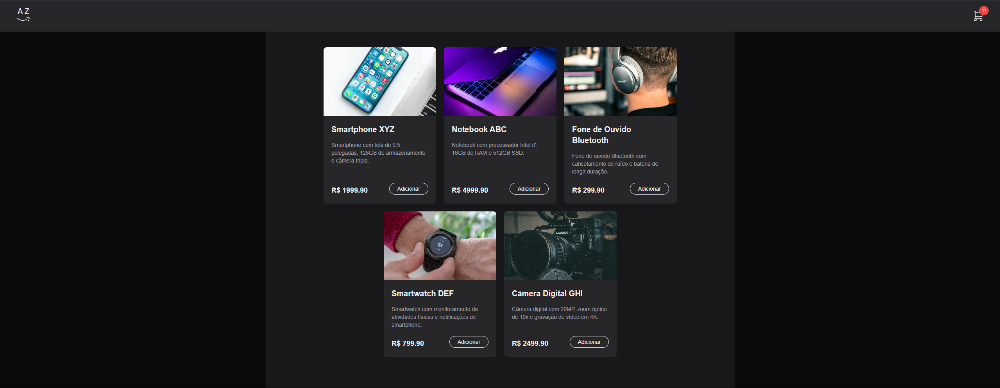

# E-commerce — Página de Produtos

Página moderna de listagem de produtos para lojas online. Totalmente responsiva, performática e construída com as versões mais recentes do ecossistema React/Next.js.

## Tecnologias e Versões (novembro 2025)

| Tecnologia              | Versão                      |
| ----------------------- | --------------------------- |
| **Next.js**             | 15.0.3 + Turbopack          |
| **React / React DOM**   | 19.0.0-rc-66855b96-20241106 |
| **TypeScript**          | ^5                          |
| **Tailwind CSS**        | 3.4.1                       |
| **@tabler/icons-react** | 3.22.0                      |

## Funcionalidades

- Listagem de produtos com cards elegantes
- Layout responsivo (mobile-first)
- Ícones modernos e escaláveis com Tabler Icons
- Tipagem completa com TypeScript
- Desenvolvimento ultra rápido com **Turbopack**
- Preparado para filtros, busca e carrinho (fácil extensão)

## Preview

